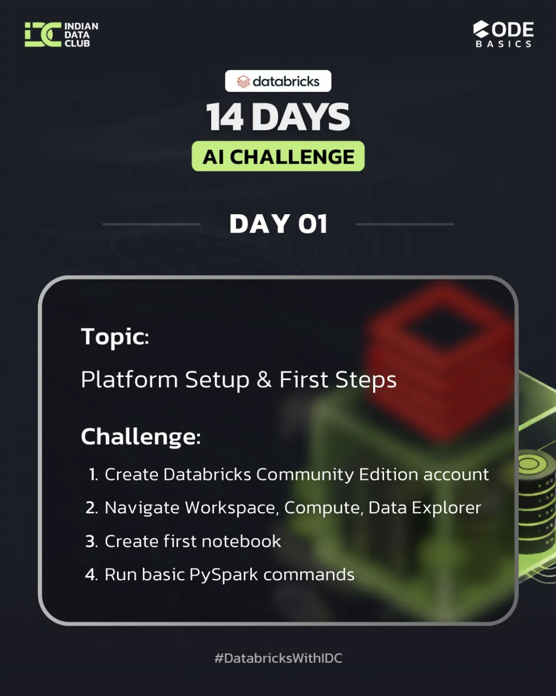

# ✅ Day 1 Completed – Databricks 14 Days AI Challenge  
**Sponsored by Databricks**

I’ve completed **Day 1** of the **Databricks AI Challenge**, and it was an exciting start to my journey into the **Databricks Lakehouse ecosystem** 🚀

---

## 📘 What I Learned Today

- Why **Databricks over Pandas & Hadoop**
- **Lakehouse Architecture** fundamentals
- Overview of **Databricks Workspace** structure
- Real-world industry use cases  
  *(Netflix, Shell, Comcast)*

---

## 🛠️ Tasks I Completed

- ✅ Created a **Databricks Community Edition** account  
- ✅ Explored **Workspace, Compute, and Data Explorer**  
- ✅ Created my **first Databricks notebook**  
- ✅ Ran basic **PySpark commands**

---

## 🙏 Acknowledgements

Grateful for the support and initiative by:
- **Databricks**
- **Codebasics**
- **Indian Data Club**

---

### 🔖 Hashtags
`#DatabricksWithIDC`  
`#14DaysAIChallenge`  
`#LearningInPublic`

---

## 📸 Screenshot / Proof

