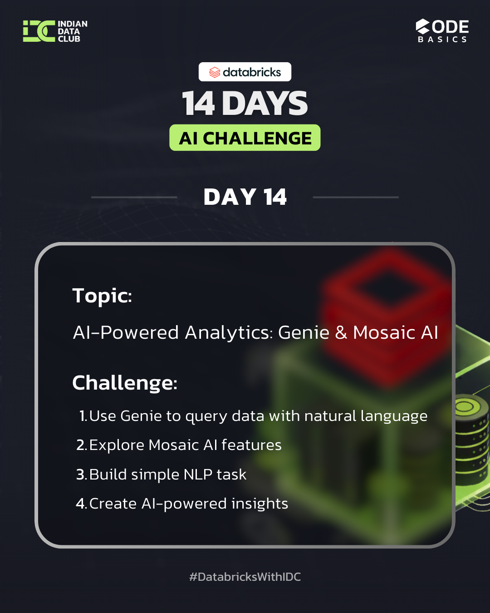

## **DAY 14 (22/01/26) – AI-Powered Analytics with Genie & Mosaic AI**

Today’s focus was on exploring **AI-powered analytics capabilities in Databricks**, specifically using **Databricks Genie** for natural language querying and understanding **Mosaic AI** for integrating Generative AI into analytical workflows. This step demonstrates how AI can simplify data access and enhance decision-making.

---

## What I Learned Today

* **Databricks Genie (Natural Language → SQL)**

  * Querying structured data using plain English
  * Reducing dependency on manual SQL writing

* **Mosaic AI Fundamentals**

  * Overview of Mosaic AI capabilities
  * Understanding how Generative AI integrates with analytics

* **Generative AI Integration**

  * Applying AI to assist data analysis
  * Enhancing insight generation using AI models

* **AI-Assisted Analysis**

  * Using AI to interpret trends and patterns
  * Improving productivity for analysts and stakeholders

---

## Tasks I Completed

### 1. Queried Data Using Databricks Genie

* Used **natural language queries** to retrieve insights from datasets
* Observed how Genie translates queries into optimized SQL

### 2. Explored Mosaic AI Features

* Reviewed Mosaic AI capabilities for model usage and AI-driven analytics
* Understood how Mosaic AI supports end-to-end AI workflows

### 3. Built a Simple NLP Task

* Implemented a basic **NLP-based task** to understand AI text processing
* Explored how AI models can assist analytical use cases

### 4. Generated AI-Powered Insights

* Combined analytics and AI to generate **actionable insights**
* Demonstrated how AI can support faster and smarter decision-making

---

## Key Takeaways

* Natural language interfaces make analytics more accessible
* Generative AI enhances traditional data analysis workflows
* AI-assisted analytics bridges the gap between technical and business users
* Tools like Genie and Mosaic AI enable faster insight generation at scale

---

## Hashtags

#DatabricksWithIDC
#14DaysAIChallenge
#GenerativeAI
#AgenticAI
#AIAnalytics
#MosaicAI
#LearningInPublic

---

## 📸 Screenshot / Proof

---

